# Ditto

在 Android 手机上运行的 AI Agent 应用。内置完整的 Alpine Linux 用户态与 Kimi Code CLI 内核，让 agent 直接在手机上读写文件、执行命令、操作其他 App、驱动浏览器——无需电脑、无需数据线、无需 root。

> 目前仅适配 Android（arm64）。

## 架构

```
┌─────────────────────────── Android App (Kotlin / Compose) ───────────────────────────┐
│                                                                                      │
│   会话 UI / 设置 / 浏览器卡片 / 虚拟屏预览                                              │
│        │                                                                             │
│   KimiAcpClient ── JSON-RPC 2.0 (ACP, over stdio) ──┐                                │
│        │                                            │                                │
│   回环网关 127.0.0.1:18792（内置 MCP / WebSearch）    │                                │
│        │                                            │                                │
└────────┼────────────────────────────────────────────┼────────────────────────────────┘
         │ proot (/system/bin/linker64 引导, -0 伪 root)│
┌────────▼────────────────────────────────────────────▼────────────────────────────────┐
│                    Alpine Linux 3.23 用户态（proot，免 root）                          │
│                                                                                      │
│   Kimi Code CLI (Node.js, `kimi acp`)  ←─ 内核                                       │
│     ├─ session-memory sidecar（会话笔记 / 上下文折叠）                                  │
│     ├─ EverMe 插件（云端长期记忆）                                                      │
│     └─ MCP client → 回环网关 → 宿主侧手机/浏览器/账号能力                               │
└──────────────────────────────────────────────────────────────────────────────────────┘
```

**Alpine Linux on Android**：APK 自带 arm64 的 `proot`、rootfs 与离线 apk 包闭包（Node.js、git、busybox 等），首次启动解包到应用私有目录即可用，无需 root、无需联网下载。proot 由 Android 系统链接器直接拉起并伪造 root，工作区 `/workspace` 独立 bind 挂载，agent 的文件操作限定在工作区内。国内网络自动切换清华 apk 镜像。

**Kimi Code CLI 内核**：内核以 npm tarball 形式内置，安装在 guest 内，以 `kimi acp` 长驻进程运行。安装时宿主会对内核打少量运行时补丁（上下文折叠 hook、ACP 失败传播、Android 文件系统限制适配等），并以 selftest 验证补丁生效。

**ACP 桥接**：应用与内核之间走 Agent Client Protocol（换行分隔的 JSON-RPC over stdio）。支持会话新建/恢复/加载/分叉/删除、权限模式切换、流式事件；宿主反向实现 ACP 的文件读写、权限询问 UI 与嵌入式终端（复用 Termux 终端组件）。

## Phone Use（Agent 模式）

Agent 可以像人一样操作手机上的任意 App——点击、滑动、输入、读屏——通过 **Shizuku（或 Root）特权进程 + 虚拟屏 + UiAutomation** 三层实现：

<table>
<tr>
<td>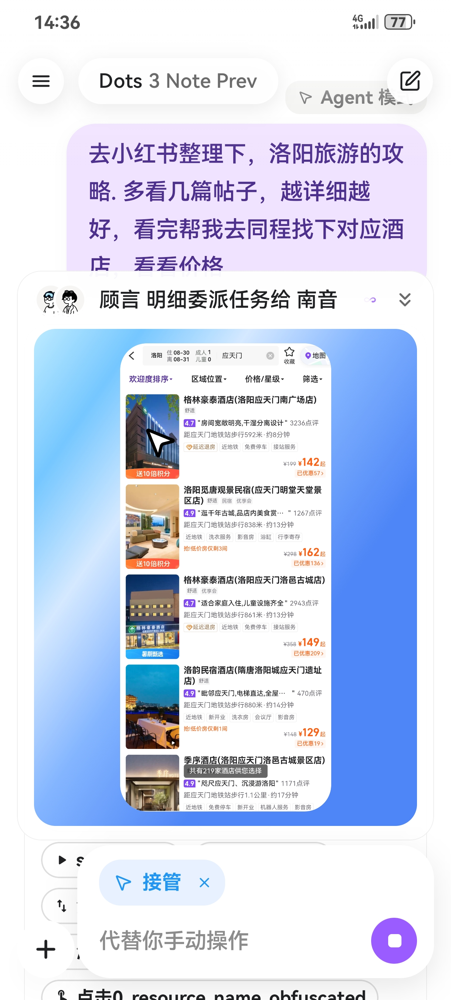</td>
<td>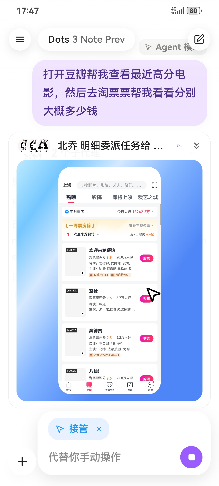</td>
</tr>
</table>

- **不占用你的真实屏幕**：目标 App 运行在独立的 VirtualDisplay 虚拟屏上，聊天内可实时预览，也可以随时手动接管（接管手势会被录制，用于教学）。也可选择直接操作真实屏。
- **零电脑、零数据线**：内置 Shizuku 安装与启动（Root 直启 / 本地无线 ADB 自连 / 配对引导三路兜底），无需用户开启无障碍服务（特权进程内直连 UiAutomation）。
- **完整的操作工具集**（`agent_display` MCP）：启动本机任意 App、点/滑/长按/双击/捏合/滚动查找、按无障碍节点语义点击（而非裸坐标）、文本粘贴输入（支持中文、不弹输入法）、系统键、强制停止 App 等。
- **多模态读屏**：截图（可裁剪、编号标注 SoM、存档取证）+ 富无障碍树（分页、区域过滤、增量 diff），每次操作返回 `tree_diff` 回执，快照过期/页面卡死有明确错误码驱动 agent 重新规划。
- **安全可靠**：密码管理器、安装器等受保护窗口拒绝操作；支付/删除类敏感控件需显式确认。
- **会学习**：卡住时可以请求用户在虚拟屏上演示一次，教学手势被蒸馏成 SOP（GUI 流程宏）存入长期记忆，之后同类任务通过 `phone_app` MCP 一键召回回放；多 App 任务可由多个 phone 子代理并行完成。
- **能"看课"**：内部音频捕获 + ASR 转写，可长时间盯守视频/网课并响应弹出的测验。

入口：设置 → Agent Mode 完成授权后，在会话输入框选择 Agent 模式芯片即可。

## 多代理协作（Agent Swarm）

主代理可以把任务拆给多个命名子代理并行执行——每个子代理有独立上下文与工具面，浏览调研、手机操作等任务都可以并发推进，并在会话内实时查看每个子代理的进度与提示词。

<table>
<tr>
<td>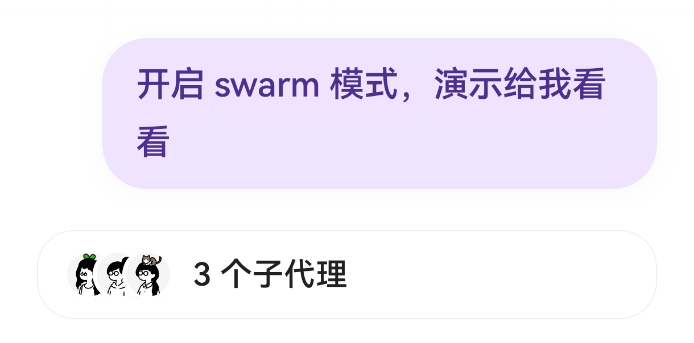</td>
<td>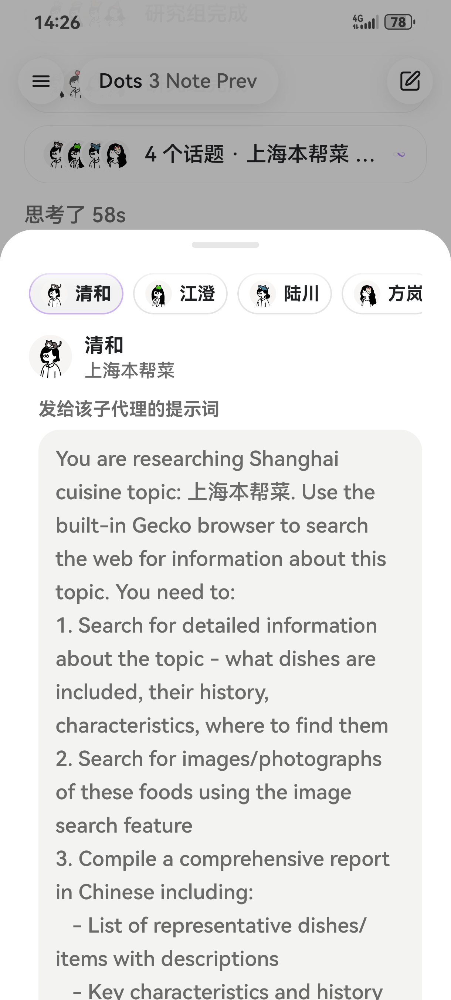</td>
</tr>
</table>

## 上下文管理与记忆管理

三层架构，分工明确：

1. **会话笔记（session-memory sidecar）**：内置 `@aether/session-memory` MCP，维护一份模型每轮自我重写的 Markdown 笔记（History + Current task），每轮请求前注入。模型写好笔记后可用 `new_context` 直接开启新上下文窗口（不做摘要）。
2. **窗口安全阀（compact）**：CLI 原生压缩按 token 阈值自动触发；也可手动输入 `/compact [可选指令]`，或点击上下文用量建议。模型选择胶囊的描边实时显示窗口占用百分比，压缩可单独指定轻量模型。
3. **EverMe 云端长期记忆**：以 kimi-code 托管插件内置。每轮对话异步沉淀，跨会话召回；**EverMe 召回的每条记忆都与原始消息的内容哈希（`aether_hash`）绑定**，模型可用 `read_original` 按哈希取回历史消息的逐字原文核对，防止记忆转述失真；手机操作经验（GUI SOP）、浏览器调研备忘也会经显著性与来源门控后写入——网页来源的记忆带污点标记，不能用于授权后续操作。

<table>
<tr>
<td>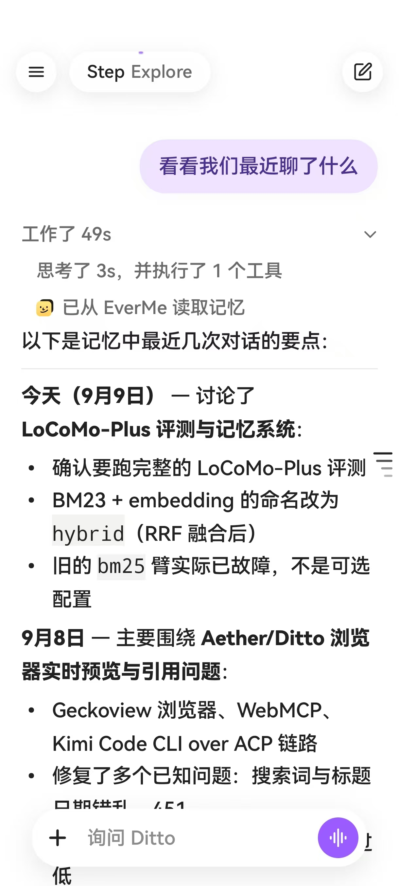</td>
<td>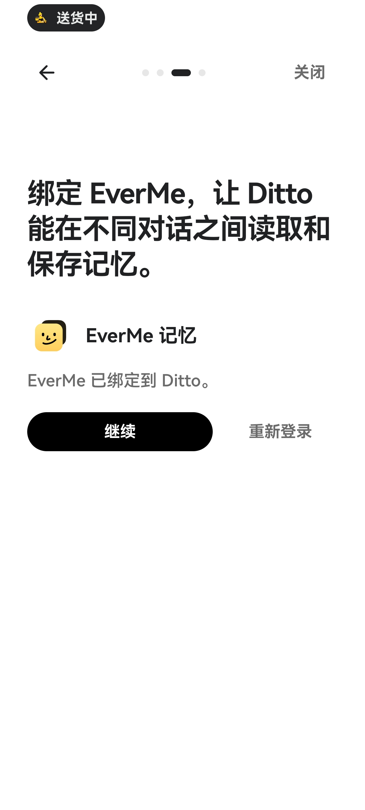</td>
</tr>
</table>

设置 → 记忆 页面可查看本地会话笔记，支持单条"忘记"和全部清除（只删本地，不动云端）。

## 内置 MCP

开箱即用的内置 MCP server，分两类：

**凭据类**（走官方服务，登录/密钥后可用）：

| Server | 能力 |
|---|---|
| `gmail` | 邮件搜索、读写等官方工具集（Google OAuth） |
| `spotify` | 音乐控制 |
| `amap` | 高德地图 |
| `github` | 压缩双工具封装，方法名对齐官方（PAT） |
| `huggingface` | 模型/数据集检索 |

**设备/会话能力类**（无条件常驻）：

| Server | 能力 |
|---|---|
| `device_catalog` | 只读的本机已装应用目录 |
| `session_memory` | 会话笔记与上下文窗口切换 |
| `agent_display` | 虚拟屏手机操作（见 Phone Use） |
| `phone_app` | 已验证 GUI 流程宏的召回与回放 |
| `webmcp` | 浏览器控制 38 个工具（见 AI Browser） |

演示（点击播放）：

<table>
<tr>
<td width="50%"><video src="https://github.com/Timothy-kira/Ditto/raw/main/docs/assets/demo-amap-mcp.mp4" width="360" controls muted playsinline></video><br>高德地图 MCP 演示</td>
<td width="50%"><video src="https://github.com/Timothy-kira/Ditto/raw/main/docs/assets/demo-spotify-mcp.mp4" width="360" controls muted playsinline></video><br>Spotify MCP 演示</td>
</tr>
</table>

<div align="center">
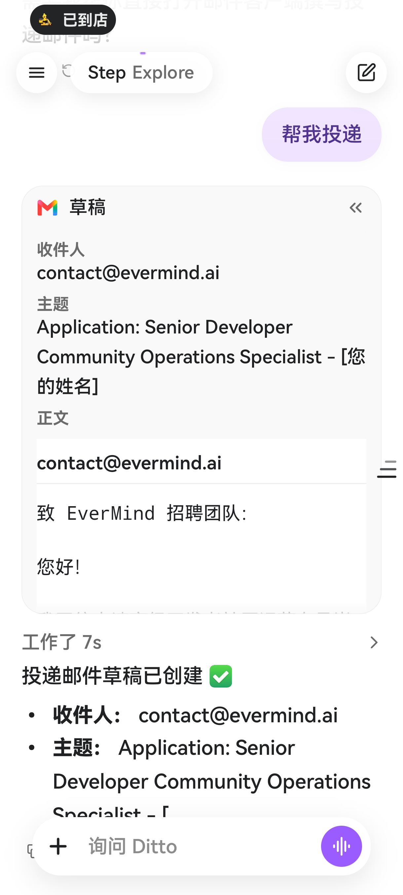
</div>

机制要点：

- 内置 server 在 ACP 会话中**恒定声明**，启停开关与登录状态在工具调用时以 `input_required` 优雅回答，不会因中途切换而重建会话、丢失 prompt 前缀缓存。
- 除 `session_memory`（stdio）外，所有内置 server 由宿主侧 `127.0.0.1:18792/mcp/<pluginId>` 回环 HTTP 网关承载，guest 内的内核直接可达。
- 支持**用户自建 MCP server**（stdio / streamable_http / upa_manifest 三种传输），在输入框勾选挂载；URL query / header / env 中的密钥会被自动识别并抽取到独立加密密钥仓。

## AI Browser

内置基于 **Mozilla GeckoView** 的完整浏览器（非 WebView），AI 通过内置 **WebExtension** 驱动：

<table>
<tr>
<td>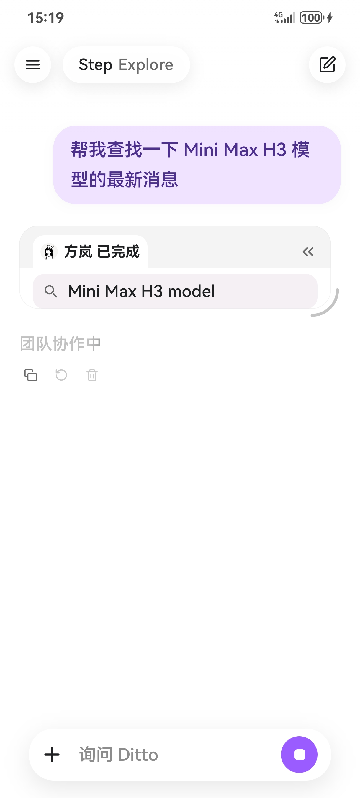</td>
<td>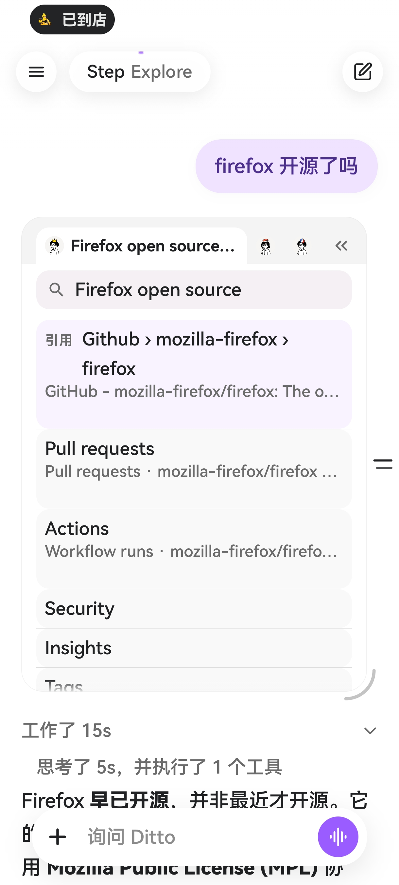</td>
<td>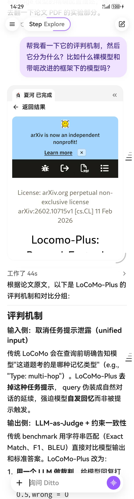</td>
<td>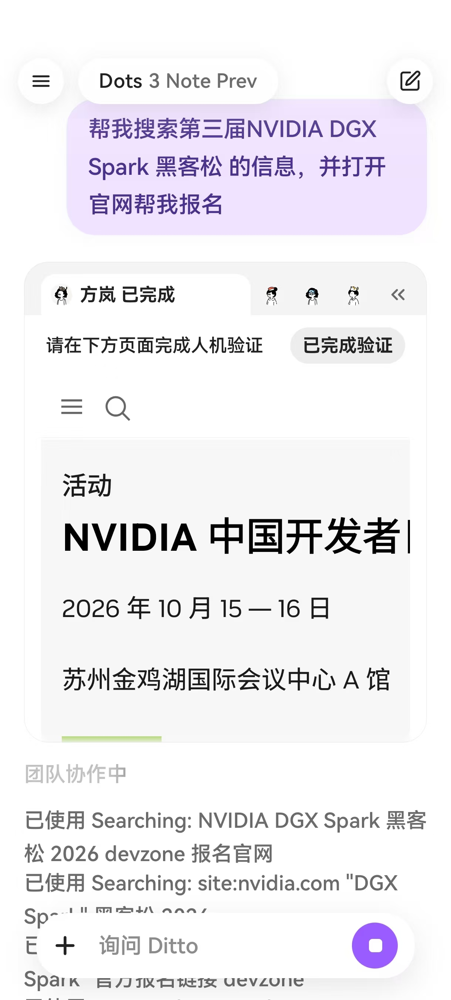</td>
<td>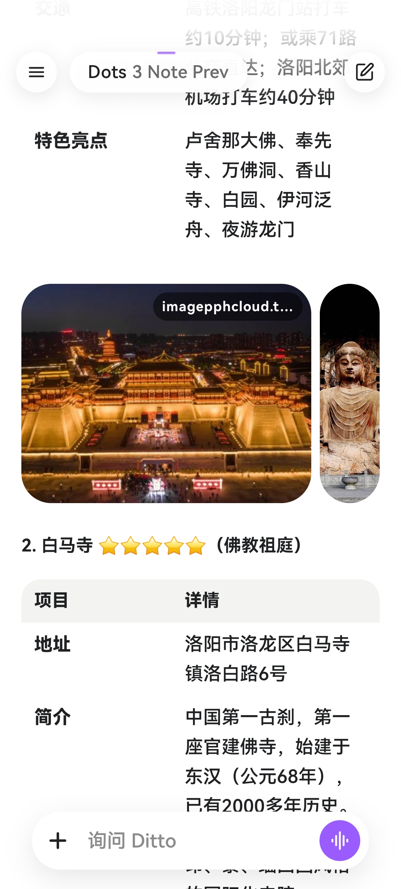</td>
</tr>
</table>

- **控制链路**：内核子代理 → `webmcp` MCP（回环网关）→ GeckoEngine → 内置扩展 `webmcp@aether` 的 content script（双向 JSON 通信）。不依赖 CDP。
- **38 个浏览器工具**：导航与多标签管理、可及性树快照（`@e` 元素引用，约 40 节点压缩快照）、页面阅读/检索/正文提取、点击/填表/下拉/键盘/悬停、文件上传（直接传工作区文件）、截图标注、JS 执行（每轮有预算）、历史搜索、密码保险库（填充时密码不进对话记录）、XHR/下载嗅探、批量抓取等。
- **WebSearch / FetchURL 由真实浏览器完成**，不依赖第三方搜索 API，答案附段落级引用。
- **支持 WebMCP**：站点可通过 `document.modelContext` 直接向 agent 注册工具（内置 polyfill）。
- **并行浏览**：topic 工作集 + per-tab 锁/租约，多个浏览器子代理可并行调研。
- **安全闸门**：支付、验证码、凭据字段在宿主代码层强制拒绝（不是提示词约定），需要时把浏览器卡片交给用户人工接管（登录/验证），完成后 agent 继续。页面内容包裹在不可信标记中防注入。
- **调研记忆**：调研任务收尾产出结构化备忘，经门控后写入 EverMe 长期记忆。

## 构建与安装

```bash
./gradlew :app:assembleDebug --no-daemon
adb -s <serial> install -r app/build/outputs/apk/debug/app-debug.apk
```

多设备环境请务必带 `-s <serial>`。更多约定见 [AGENTS.md](AGENTS.md)。
